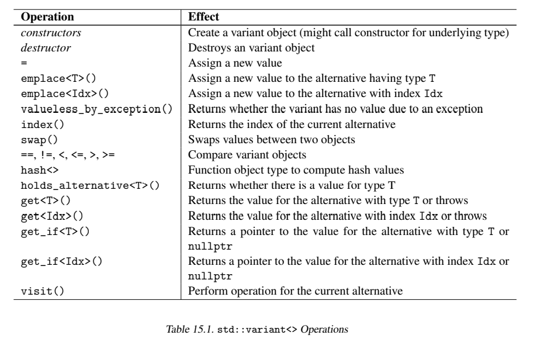

# Chapter 15 `std::variant<>`(可变类型)

起源于C语言，C++也提供为`union`的支持，它能够持有一个或几个不同类型的值。然而，这项语言特性也有一些缺点：

* 对象不知道它们当前持有的值是什么类型
* 你不能使用非基础类型，例如std::string(在没有提供特定支持的情况下)
* 你不能从一个`union`派生

通过`std::variant<>`类型C++标准库提供了一个可辨识的`union`（这意味着有一个确定的类型列表并且你可以知道当前类型是什么）。这个类型有如下特征：

* 当前值的类型总是已知的
* 它可以持有任何确定的类型
* 你可以从它派生

事实上，一个`std::variant<>`持有的值类型有若干选项，这些选项一般有不同的类型。但是两个选项可能有相同的类型，这在这两个选项代表的语义不同时会很有用（例如，两个选项可以都是字符串，分别代表数据库中不同的列，你可以知道当前的值代表的是哪一列）。（译者注：经过测试，如果有两个选项类型都为type，那么虽然声明对象时不会报错，但在不使用`in_place_index`标签的情况下给该对象赋予type类型的值时会报错，因此可以认为一般情况下不同选项不能持有相同类型。因此下文用"类型"代替"选项"）

`variant`的内存大小等于底层类型的大小加上管理当前类型所需的固定内存。它不会在堆上分配内存。

一般来说，`variant`不可能为空除非你明确的指明了一个类型来标志其为空。然而，在非常少见的请况下（例如在赋予新值的时候出现了异常）`variant`会变为不持有任何值的状态。

和`std::optional<>`和`std::any`一样该类型有值语义。也就是说，使用现有对象的值创建新对象的时候会对当前值进行深拷贝。因此，拷贝一个`std::variant<>`的开销和拷贝一个当前类型的值是相同的。该类型也支持move语义。

## 15.1 使用`std::variant<>`

下面的代码演示了`std::variant<>`的核心能力：

```cpp
#include <variant>
#include <iostream>

std::variant<int, std::string> var{"hi"};   //用一个字符串初始化
std::cout << var.index();                   //打印出1
var = 42;                                   //现在持有一个int值
std::cout << var.index();                   //打印出0
...
try {
    std::string s = std::get<std::string>(var); //通过类型访问
    int i = std::get<0>(var);                   //通过索引访问
}
catch (const std::bad_variant_access & e) {     //当使用了错误的类型或索引进行访问时会抛出异常
    ...
}
```

成员函数`index()`可以用来查明当前的值是哪一个类型（第一个类型的索引为0）。

初始化和复制总是使用最优匹配原则来找出新的选项。如果没有类型能精确匹配，结果可能会出乎意料（见15.3.1节）。

注意空的`variant`，带有引用成员的`variant`，带有C风格数组成员的`variant`，带有不完全类型的`variant`（例如`void`）都是被禁止的。

没有表示空的状态。这意味着对于每一个`variant`对象至少会有一个构造函数被调用。默认构造函数使用第一个类型的默认构造函数来初始化第一个类型：

```cpp
std::variant<std::string, int> var;     //=>var.index()==0, value == ""
```

如果第一个类型没有默认构造函数，那么调用`variant`的构造函数将会导致一个编译期错误：

```cpp
struct NoDefConstr {
    NoDefConstr(int i) {
        std::cout << "NoDefConstr::NoDefConstr(int) called\n";
    }
};

std::variant<NoDefConstr, int> v1;  //ERROR:不能调用第一个类型的默认构造函数
```

辅助类型`std::monostate`提供了处理这种情况的能力和模仿空状态的能力。

#### `std::monostate`

为了支持第一个类型没有默认构造函数的`variant`，标准库提供了一个辅助类型`std::monostate`。类型`std::monostate`总是拥有相同的状态。因此，它们总是等价的。它们出现的目的是作为一个可选的类型以让`variant`能够不持有值或持有任何其它值。

也就是说，`std::monostate`可以当作第一个类型来为`variant`提供默认构造函数。例如：

```cpp
std::variant<std::monostate, NoDefConstr> v2;   //OK
std::cout << "index: " << v2.index() << '\n';   //打印出0
```

某种程度上你也可以把这种状态理解为空信号。

这里有几种不同的方式检查`monostate`，这些代码也展示了一些其他的操作，如下：

```cpp
if (v2.index() == 0) {
    std::cout << "has monostate\n";
}
if (!v2.index()) {
    std::cout << "has monostate\n";
}
if (std::holds_alternative<std::monostate>(v2)) {
    std::cout << "has monostate\n";
}
if (std::get_if<0>(&v2)) {
    std::cout << "has monostate\n";
}
if (std::get_if<std::monostate>(&v2)) {
    std::cout << "has monostate\n";
}
```

`get_if<T>()`的参数是一个指向`variant`的指针，如果当前类型为`T`则返回指向当前值的指针，否则返回`nullptr`。这和`get<T>()`不同，`get<T>()`是以引用作为参数，并在正确的情况下以值的形式返回当前值，否则抛出异常。

像通常一样，你可以给`variant`赋予一个新的值，你也可以再次给它赋值为`monostate`来表示值为空：

```cpp
v2 = 42;
std::cout << "index: " << v2.index() << '\n';   //index: 1

v2 = std::monostate{};
std::cout << "index: " << v2.index() << '\n';   //index: 0
```

#### 从`variant`派生

你可以从`variant`派生。例如，你可以像下面这样定义一个从`std::variant<>`派生的聚合体（见第4章）：

```cpp
class Derived : public std::variant<int, std::string> {
};

Derived d = {{"hello"}};
std::cout << d.index() << '\n';         //打印出1
std::cout << std::get<1>(d) << '\n';    //打印出:hello
d.emplace<0>(77);                       //初始化为int，销毁string
std::cout << std::get<0>(d) << '\n';    //打印出:77
```

## 15.2 `std::variant<>`的类型和操作

这一节详细描述了`std::variant<>`的类型和操作.

### 15.2.1 `std::variant`的类型

在头文件`<variant>`中C++标准库像下面这样定义了类`std::variant<>`：

```cpp
namespace std {
    template<typename Types...> class variant;
}
```

也就说是，`std::variant<>`是一个可变参数类模板（C++11引入的一个特性，允许处理任意数量的类型）。

另外，还定义了如下的类型和对象：

* 类型`std::variant_size`
* 类型`std::variant_alternative`
* 值`std::variant_npos`
* 类型`monostate`
* 异常类`std::bad_variant_access`，该类继承自`std::exception`。

`variant`也使用了定义在`<utility>`中的`std::in_place_type`（其类型为`std::in_place_type_t`）和`std::in_place_index`（其类型为std::in_place_index_t）对象。

### 15.2.2 `std::variant<>`的操作

`std::variant`的操作如下表所示，列出了`std::variant<>`提供的所有操作。



#### 构造

默认情况下，`variant`的默认构造函数会调用第一个类型的默认构造函数：

```cpp
std::variant<int, int, std::string> v1;     //第一个int为0，index()==0
```

第一个类型会进行默认值初始化，这意味着对于基础类型值将为0，false，或nullptr。

如果传递一个值进行初始化，将会使用最佳匹配：

```cpp
std::variant<long, int> v2{42};
std::cout << v2.index() << '\n';    //打印出1
```

然而，如果有两个类型同等匹配就会导致歧义：

```cpp
std::variant<long, long> v3{42};        //错误：歧义
std::variant<int, float> v4{42.3};      //错误：歧义
std::variant<int, double> v5{52.3};     //OK
std::variant<std::string, std::string_view> v6{"hello"};    //错误：歧义
std::variant<std::string, std::string_view, const char*> v7{"hello"};   //OK
std::cout << v7.index() << '\n';        //打印出2
```

为了传递多个值进行初始化，你必须使用`in_place_type`或者`in_place_index`标签：

```cpp
std::variant<std::complex<double>> v8{3.0, 4.0};    //错误
std::variant<std::complex<double>> v9{{3.0, 5.0}};  //错误
std::variant<std::complex<double>> v10{std::in_place_type<std::complex<double>>, 3.0, 4.0};
std::variant<std::complex<double>> v11{std::in_place_index<0>, 3.0, 4.0};
```

你也可以使用`in_place_index`标签来消除歧义或无视匹配优先级：

```cpp
std::variant<int, int> v12{std::in_place_index<1>, 77}; //初始化第二个int
std::variant<int, long> v13{std::in_place_index<1>, 77};//初始化long，不是int
```

你甚至可以传递一个初值列：

```cpp
//用一个带有lambda作为排序准则的set初始化variant
auto sc = [] (int x, int y) {
            return std::abs(x) < std::abs(y);
          };
std::variant<std::vector<int>, std::set<int, decltype(sc)>>
    v14{std::in_place_index<1>, {4, 8, -7, -2, 0, 5}, sc}
```

你不可以为`std::variant<>`使用类模板参数推导（见第8章），而且没有`make_variant<>()`辅助函数（不像`std::optional<>`和`std::any`）。这些都没有意义，因为`variant`的目标是处理多种类型。

#### 访问值

访问值的通常方式是调用`get<>()`函数。你可以传递一个索引或者一个只出现一次的类型。例如：

```cpp
std::variant<int, int, std::string> var;    //第一个int设为0，index()==0

auto a = std::get<double>(var);             //编译期错误：没有double类型
auto b = std::get<4>(var);                  //编译期错误：没有第四项
auto c = std::get<int>(var);                //编译期错误：两个int

try {
    auto a = std::get<std::string>(var);    //抛出异常（此时值为第一个int）
    auto i = std::get<0>(var);              //OK，i==0
    auto j = std::get<1>(var);              //抛出异常（此时值为第一个int）
}
catch (const std::bad_variant_access & e) { //处理无效的访问
    std::cout << "Exception: " << e.what() << '\n';
}
```

还有一个检查访问是否有效的API：

```cpp
if (auto ip = std::get_if<1>(&var); ip) {
    std::cout << *ip << '\n';
}
else {
    std::cout << "alternative with index 1 not set\n";
}
```

你必须向`get_if<>()`传递一个`variant`的指针，它会返回一个指向当前值的指针或者`nullptr`。注意这里使用了带初始化的`if`语句（见2.1节），这让我们可以对刚创建的变量进行检查。

另一种访问`variant`的方法是使用`variant`访问器（见15.2.3节）。

#### 修改值

赋值操作和`emplace()`函数都可以用于修改值：

```cpp
std::variant<int, int, std::string> var;    //第一个int设为0，index()===0
var = "hello";                              //值变为字符串，index()==2
var.emplace<1>(42);                         //值变为第二个int，index()==1
```

你也可以使用`get<>()`或`get_if<>()`来赋予一个新值：

```cpp
std::variant<int, int, std::string> var;    //第一个int设为0，index==0
std::get<0>(var) = 77;                      //OK，因为当前值为第一个int
std::get<1>(var) = 99;                      //抛出异常（当前值为第一个int）

if (auto p = std::get_if<1>(&var); p) {     //如果值为第二个int
    *p = 42;                                //修改它
}
```

另一种修改值的方法是使用`variant`访问器（见15.2.节）。

#### 比较

对于两个相同类型的`variant`（例如，含有的选项和顺序都相同）你可以使用通常的比较运算符。这些运算符的行为依照下面的规则：

* 当前值的选项较为靠前的小于靠后的
* 如果两个`variant`当前值的选项相同，那么会调用该选项类型的比较运算符进行比较。注意两个`std::monostate`类型的对象总是想等的。
* 两个特殊状态`valueless_by_exception()`（见15.2.4节）为true的`variant`也是相等的。否则，`valueless_by_exception()`为true的`variant`小于另一个。

例如：

```cpp
std::variant<std::monostate, int, std::string> v1, v2{"hello"}, v3{42};
std::variant<std::monostate, std::string, int> v4;

v1 == v4;           //编译期错误
v1 == v2;           //返回false
v1 < v2;            //返回true
v1 < v3;            //返回true
v2 < v3;            //返回false

v1 = "hello";
v1 == v2;           //返回true

v2 = 41;
v2 < v3;            //返回true
```

#### 移动语义

`std::variant<>`也支持移动语义。如果你搬移一个对象整体，那么将会复制这个对象的状态并搬移当前的值。结果是旧对象的状态仍然保持不变，但值变为不确定。你也可以移动走内含对象的值或将值移入到内含对象。

#### 哈希

只有当每一个选项类型都有哈希值时`variant`才有哈希值。注意`variant`的哈希值不是当前类型的哈希值。

### 15.2.3 访问器

必须要为每一个可能的类型都提供一个函数调用运算符，然后才能对当前的类型调用相应的重载版本。

#### 使用函数对象作为访问器

例如：

```cpp
struct MyVisitor
{
    void operator()(double d) const {
        std::cout << d << '\n';
    }
    void operator()(int i) const {
        std::cout << i << '\n';
    }
    void operator()(const std::string& s) const {
        std::cout << s << '\n';
    }
};

std::variant<int, std::string> var(42);
...
std::visit(MyVisitor(), var);   //为匹配的类型调用()运算符
```

如果没有对所有可能的类型的支持或者调用有歧义的话`visit()`的调用就会导致编译期错误。

你也可以使用访问器来修改当前的类型（但请不要赋予一个新的类型）。例如：

```cpp
struct Twice
{
    void operator()(double& d) const {
        d *= 2;
    }
    void operator()(int& i) const {
        i *= 2;
    }
    void operator()(std::string& s) const {
        s = s + s;
    }
}

std::visit(Twice(), var);
```

因为这种方式只能通过类型来区分调用哪个版本的括号运算符，所以对同一种类型你不能做不同的处理。

注意所有的函数调用运算符都应该被标记为`const`，因为它们是无状态的。（它们不改变除了参数以外的任何值）。

#### 使用泛型lambda作为访问器

最简单的使用这种特性的方式是使用泛型lambda，它是一个可以接受任何类型作为参数的函数对象：

```cpp
auto printvariant = [](const auto& val) {
                        std::cout << val << '\n';
                    };
...
std::visit(printvariant, var);
```

这里，泛型lambda转换为另一个有函数调用预算符的闭包类型：

```cpp
class CompilerSpecifyClosureTypeName {
  public:
    template<typename T>
    auto operator() (const T& val) const {
        std::cout << val << '\n';
    }
};
```

因此，被传递给`std::visit()`的lambda将会在调用有效时（也就是输出运算符有效时）编译成功。

你也可以使用一个lambda来修改当前选项的值：

```cpp
// 将当前的值变为两倍
std::visit([](auto& val) {
                val = val + val;
            },
            var);
```

或者：

```cpp
// 将当前的值置为默认情况
std::visit([](auto& val) {
                val = std::remove_reference_t<decltype(val)>{};
            },
            var);
```

你甚至可以通过编译期`if`语句（见第9章）来针对不同的类型进行不同的处理。例如：

```cpp
auto dblvar = [](auto& val) {
    if constexpr(std::is_convertible_v<decltype(val), std::string>) {
        val = val + val;
    }
    else {
        val *= 2;
    }
};
...
std::visit(dblvar, var);
```

这里，当值为`std::string`类型时调用泛型lambda的实例来执行语句：

```cpp
val = val + val;
```

而对于其他的类型，例如`int`或者`double`，将调用lambda的实例来执行：

```cpp
val *= 2;
```

#### 使用重载的lambda作为访问器

通过使用一个函数对象和lambda的重载器，你也可以定义一系列的lambda，然后选择其中的最优匹配作为访问器。

假设，重载器是如下定义的`overload`（见13.1节）：

*tmpl/overload.hpp*

```cpp
//从传递进来的基类里继承所有函数调用运算符
template<typename... Ts>
struct overload : Ts...
{
    using Ts::operator()...;
};

//基类的类型通过传入的参数来推导
template<typename... Ts>
overload(Ts...) -> overload<Ts...>;
```

你可以使用`overload`来访问一个`variant`：

```cpp
std::variant<int, std::string> var(42);
...
std::visit(overload{    //为每一个选项调用最优匹配
            [](int i) { std::cout << "int: " << i << '\n'; },
            [](const std::string& s) {
                std::cout << "string: " << s << '\n';
            }
        },
        var);
```

你也可以使用泛型lambda，它会自动生成最优匹配。例如，如果想要修改当前的`variant`的选项，你可以使用下面的`overload`来将一个字符串或其它类型的值翻倍（见13.1节）：

```cpp
auto twice = overload{
    [](std::string& s) { s += s; },
    [](auto& i) { i *= 2; },
};
```

这个`overload`会将字符串的值再重复一遍，将其它类型的值乘以2，下面展示了具体的应用：

```cpp
std::variant<int, std::string> var(42);
std::visit(twice, var);     //42变为了84
...
var = "hi";
std::visit(twice, var);     //"hi"变为了"hihi"
```

### 15.2.4 异常导致的无值

当修改一个`variant`时如果修改操作抛出了一个异常，`variant`的值可能进入一个非常特殊的状态：`variant`已经丢失了旧值，但并没有得到新值。例如：

```cpp
struct S {
    operator int() { throw "EXCEPTION"; }   //任何向int的转换都会抛出异常
};

std::variant<double, int> var{12.2};    //初始化为double
var.emplace<1>(S{});        //抛出异常
```

如果这种情况发生了，那么：

* `var.valueless_by_exception()`返回true
* `var.index()`返回`std::variant_nops`

这标志着当前的`variant`没有值。

精确的保证如下：

* 如果`emplace()`抛出了异常那么`valueless_by_exception()`总是返回true
* 如果 `operator=()`抛出异常且这次修改只影响值不影响选项，`valueless_by_exception()`和`index()`将会保持旧的状态。值的状态将依赖于当前值类型的异常保证。
* 如果 `operator=()`抛出异常且会更改选型，那么`variant`*可能*将不再持有值（`valueless_by_exception()`*可能*变为true。这依赖于异常到底是什么时机被抛出的。如果在类型转换期间抛出，此时还没有开始修改变量的值，那么这个`variant`将保持旧值。

通常情况下，当你尝试修改`variant`变量时如果抛出异常就不要再使用这个变量是没问题的。但如果你想一直使用一个`variant`即使它中途抛出了异常，那么你需要更小心的检查它的状态。例如：

```cpp
std::variant<double, int> var{12.2};    //初始化为double
try {
    var.emplace<1>(S{});        //被设置为int时抛出异常
} catch (...) {
    if (!var.valueless_by_exception()) {
        ...
    }
}
```

## 15.3 特殊情况

特定的`variant`可能导致特殊的或未预期的行为.

### 15.3.1 同时有`bool`和`std::string`选项

如果一个`std::variant<>`同时有一个`bool`和`std::string`类型的选项，那么给它赋值一个字符串字面量可能会导致令人惊奇的行为，因为字符串字面量转换为`bool`类型的优先级比转换为`std::string`的优先级更高。例如：

```cpp
std::variant<bool, std::string> v;
v = "hi";       //将v设为bool类型
std::cout << "index: " << v.index() << '\n';
std::visit([](const auto& val) {
            std::cout << "value: " << val << '\n';
        },
        v);
```

这段代码片段会有如下输出：

```cpp
index: 0
value: true
```

因此，字符串字面量被转换为一个`bool`类型的值并用来初始化`variant`（值为true因为指针非空）。

这里有一些方法来“修复”这个问题：

```cpp
v.emplace<1>("hello");              //显式的赋值给第二个选项

v.emplace<std::string>("hello");    //显示赋值给string选项

v = std::string{"hello"};           //确保将string赋值给对象

using namespace std::literals;      //确保将string赋值给对象
v = "hello"s;
```

## 15.4 后记

可变对象最早在2005年由Axel Naumann在[https://wg21.link/n4218](https://wg21.link/n4218)上提出，参考实现为`Boost.Variant`。最后被接受的正式提案由Axel Naumann在[https://wg21.link/p0088r3](https://wg21.link/p0088r3)上发表。

Tony van Eerd在[https://wg21.link/p0393r3](https://wg21.link/p0393r3)显著的改进了比较运算符的语义。Vicente J. Botet Escriba在[https://wg21.link/p0032r3](https://wg21.link/p0032r3)上协调了它和`std::optional<>`，`std::any`的API。Jonathan Wakely在[https://wg21.link/p0504r0](https://wg21.link/p0504r0)上修复了`in_place`的行为。不允许引用，不完全类型，数组和空可变对象由Erich Keane在[https://wg21.link/p0510r0](https://wg21.link/p0510r0)提出。

