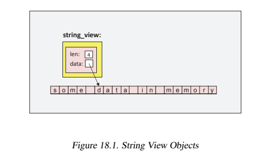

# String Views

在C++17中，标准库提供了一个特殊的类型叫做`std::string_view`，它允许我们在不分配内存的情况下处理字符序列例如`string`。也就是说，`std::string_view`对象指向外部的字符序列，而不是持有这些字符。也就是说，这个对象可以被看作是对一个字符序列的引用。



使用一个`string_view`的开销是很小的（以值传递一个`string_view`的开销总是很小），而且速度很快。然而，它可能导致潜在的危险，因为它就像原始指针一样要求程序员确保指向的字符序列仍然有效。

## 18.1 和`std::string`的不同

相比于`std::string`，`std::string_view`对象有如下特性：

* 底层的字符序列是只读的。没有允许修改这些字符的操作。你只能赋予一个新值，交换值或者在首部或尾部删除字符。
* 字符序列不保证以`null('\0')`结尾。因此，一个`string view`不是一个`null`结尾的的字节流（NTBS）。
* 它的值可能是`nullptr`，例如使用默认构造函数初始化一个`string view`之后用`data()`访问。
* 不支持`allocator`。

因为可能存在`nullptr`值且有可能缺少`null`终止符，因此在使用操作符`[]`或`data()`访问字符之前你必须先使用`size()`获取长度。

## 18.2 使用`string view`

`string view`有两个主要的应用：

1. 你可能有已经分配过或映射过内存的字符序列或`string`并且想在不分配更多内存的情况下使用这些值。典型的例子是使用内存映射文件或者处理一段非常长的文字中的子字符串。
2. 你想要提升接受字符串为参数进行一些只读处理的函数的性能。这种情况的一个特殊形式是像处理一个有和`string`有类似API的对象一样处理字符串字面量：

```cpp
static constexpr std::string_view hello{"hello world"};
```

第一个例子通常意味着只需要`string view`传递参数，然而，程序逻辑必须确保底层的字符序列必须保持有效（例如：映射文件的内容没未被取消映射）。任何时候你可以使用`string view`来初始化或赋值给`std::string`。

但是请注意，使用`string view`就像是在使用“更好的`string`”。它可能导致糟糕的性能和严重的运行时错误（见18.3.1）。因此请认真的阅读下面的章节。

## 18.3 像使用`string`一样使用`string view`

一个简单的例子，使用一个`string_view`作为一个只读字符串。下面的例子使用一个`string view`参数作为前缀打印出一个集合中的所有元素：

```cpp
#include <string_view>

template<typename T>
void printElems(const T& coll, std::string_view prefix = std::string_view{})
{
    for (const auto& elem : coll) {
        if (prefix.data()) {    //防止是nullptr
            std::cout << prefix << ' ';
        }
        std::cout << elem << '\n';
    }
}
```

这里，通过使用`std::string_view`作为参数我们可能比使用`std::string`的函数省下分配堆内存的过程。例如：如果我们像下面这样声明：

```cpp
template<typename T>
void printElems(const T& coll, const std::string& prefix = std::string{});
```

并且我们传递了一个字符串字面量作为参数，那么将会创建一个临时的`string`，在没有短字符串优化的情况下这会分配堆内存。通过使用`string view`在这种情况下将不会分配内存，因为`string view`仅仅指向字符串字面量。

然而，注意在使用一个值未知的`string view`的时候必须先检查`data()`是否为`nullptr`。

另一个例子，使用一个`string_view`作为只读字符串，可以改进`std::optional<>`中的`asInt()`示例（见14.1.1节）：

*lib/asint.cpp*

```cpp
#include <optional>
#include <string_view>
#include <utility>  //for from_chars()
#include <iostream>

//如果可能则将string转换为int
std::optional<int> asInt(std::string_view sv)
{
    int val;
    //将字符序列读入int
    auto [ptr, ec] = std::from_chars(sv.data(), sv.data()+sv.size(), &val);

    //如果有一个错误码，返回空值
    if (ec) {
        return std::nullopt;
    }
    return val;
}

int main()
{
    for (auto s : {"42", "  077", "hello", "0x33"}) {
        //将s转换为int，并且在可能的情况下使用结果
        std::optional<int> oi = asInt(s);
        if (oi) {
            std::cout << "convert '" << s << "' to int: " << *oi << "\n";
        }
        else {
            std::cout << "can't convert '" << s << "' to int\n";
        }
    }
}
```

这里，`asInt()`以值接受一个`string view`作为参数。然而这意味着我们通常必须检查`data()`为`nullptr`和`size()`为0的情况。我们间接的进行了这个检查，我们将`string view`的字符范围传递给了新的标准库函数`std::from_chars()`。再一次声明，我们必须小心`string view`没有值的情况。然而，如果`string view`的值为`nullptr`，那么我们传递给`from_chars()`的范围就是`nullptr`到`nullptr+0`，这是一个有效的空范围，因为对于任何指针类型加0都是合法的但却没有任何效果的操作。

### 18.3.1 `string view`可能导致问题

通常“智能对象”例如智能指针总是比相应的原生语言特性更安全（或至少不会更危险）。因此，可能你的第一印象是`string view`作为一种对字符串的引用，应该至少和使用字符串引用一样安全。但很不幸的是情况并不是这样。`string view`事实上比字符串引用或智能指针更加危险。它们更类似于原始的字符串指针。

#### 不要将`string`赋值给`string view`

考虑我们声明了一个返回新`string`的函数：

```cpp
std::string retString();
```

使用返回值一般都是安全的：

* 将返回值赋值给string或者一个auto声明的对象是安全的（但性能并不总是最好的）：

```cpp
auto std::string s1 = retString();      //安全
```

* 将返回值赋给一个字符串引用，只要可行，就能和使用本地变量一样安全，因为引用延长了返回值的生存周期直到引用的生存周期结束：

```cpp
std::string& s2 = retString();          //编译期错误（缺少const）

const string& s3 = retString();         //s3延长了返回之的生存周期
std::cout << s3 << '\n';                //OK

auto&& s4 = retString();                //s4延长了返回之的生存周期
std::cout << s4 << '\n';                //OK
```

`string view`没有这种安全性。它既不拷贝也不延长返回值的生命周期：

```cpp
std::string_view sv = retString();      //sv并不延长返回的字符串的生存周期
std::cout << sv << '\n';                //运行时错误：返回的字符串已经被销毁了
```

这里，在第一个语句结束的时候返回的字符串就已经被销毁了，因此使用指向它的`sv`将会导致一个引发不确定行为的运行时错误。

当调用如下语句时会有同样的问题：

```cpp
const char* p = retString().c_str();
```

或者：

```cpp
auto p = retString().c_str();
```

出于这个原因，当返回一个`string view`时你也要非常小心：

```cpp
//非常危险
std::string_view substring(const std::string&, std::size_t idx = 0);

//因为：
auto sub = substring("very nice", 5);   //返回传入的临时字符串的view，但临时字符串在这条语句结束时就会被销毁

std::cout << sub << '\n';               //运行时错误：临时字符串已经被销毁了
```

#### 不要返回`string`的`string view`

让`string`成员的getter返回一个`string view`是非常危险的设计。因此，你**不**应该像下面这样写：

```cpp
class Person {
    std::string name;
  public:
    Person (std::string n) : name{std::move(n)} {
    }
    std::string_view getName() const {      //不要这么做
        return name;
    }
};
```

因为，就像下面的代码一样这样做将可能引发致命的运行期错误：

```cpp
Preson createPerson();

auto n = createPreson().getName();      //临时字符串已经被销毁
std::cout << "name: " << n << '\n';     //致命运行期错误
```

如果此处`getName()`返回一个`string`或`string`的引用你就不会遇到这个问题。

#### 函数模板应该使用`auto`作为返回类型

注意意外地将一个返回的`string`赋值给`string view`是很常见的。例如，下面的两个函数的定义看起来都很不错：

```cpp
//定义返回string的string view的+运算符
std::string operator+ (std::string_view sv1, std::string_view sv2) {
    return std::string(sv1) + std::string(sv2);
}

//泛型连接函数
template<typename T>
T concat (const T&x, const T& y) {
    return x + y;
}
```

然而，一起使用它们将会很容易的导致致命的运行期错误：

```cpp
std::string_view hi = "hi";
auto xy = concat(hi, hi);       //xy是一个`std:string_view
std::cout << xy << '\n';        //致命的运行期错误：xy引用的字符串已被销毁
```

像这样的代码很容易被意外地写出来。真正的问题是`concat()`的返回值类型。如果它将返回值类型声明为由编译器推导，那么上例中的`xy`将被初始化为`std::string`：

```cpp
//改进的泛型连接函数
template<typename T>
auto concat (const T& x, const T& y) {
    return x + y;
}
```

另外，在一个调用链中使用`string view`可能会适得其反。例如，如果你定义了一个有如下构造函数的类`Person`：

```cpp
class Person {
    std::string name;
  public:
    Person (std::string_view n) : name{n} {
    }
    ...
};
```

传递一个字符串字面量或者`string`都是没有问题的：

```cpp
Person p1{"Jim"};               //没有性能开销
std::string s = "Joe";
Person p2{s};                   //没有性能开销
```

但是传递一个`move`的`string`将带来昂贵的开销，因为传递进入的字符串首先要隐式转换为一个`string view`，然后再用它创建一个新的字符串，这将再次分配内存：

```cpp
Person p3{std::move(3)};        //性能开销：move中断
```

正确的做法是不要在这种情况下使用`std::string_view`。以值传参然后将它`move`给成员（见18.3.1节）仍然是最好的方法。因此，构造函数和getter应该像下面这样：

```cpp
class Person {
    std::string name;
  public:
    Person (std::string n) : name{std::move(n)} {}
    std::string getName() const {
        return name;
    }
};
```

#### 安全使用`string view`的总结

作为总结：**小心使用`std::string_view`**，意味着应该改变你编码的一般风格：

* 不要在传递参数给一个字符串的API中使用`string view`。
    - 不要使用`string view`实参来初始化`string`成员。
    - 一个`string view`链的结尾不要是一个`string`。
* 不要返回一个`string view`
    - 除非这个函数只是转发输入的参数或者你明确标记了这个函数的危险性，例如通过它的命名来标记危险
* **函数模板**绝不应该返回传入的泛型参数`T`。
    - 应该返回`auto`
* 永远不要用一个返回值初始化一个`string view`
* **不要**将返回泛型类型的函数模板的返回值赋给`auto`声明的变量
    - 这意味着，AAA（Almost Always Auto）模式在`string view`这里不再适用

如果这些规则太复杂或者难以遵守，请根本不要使用`std::string_view`（除非你知道你正在做什么）。

## 18.4 `string view`类型和操作
