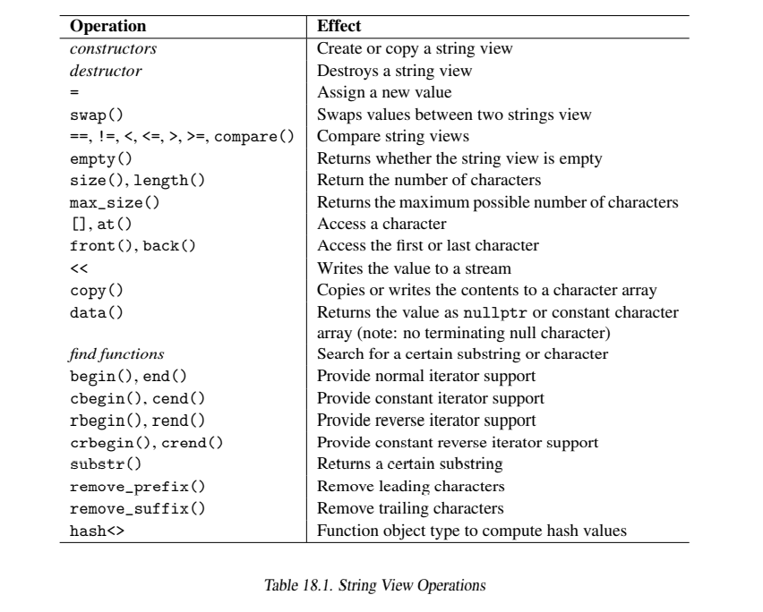

# String Views

在C++17中，标准库提供了一个特殊的类型叫做`std::string_view`，它允许我们在不分配内存的情况下处理字符序列例如`string`。也就是说，`std::string_view`对象指向外部的字符序列，而不是持有这些字符。也就是说，这个对象可以被看作是对一个字符序列的引用。


使用一个`string_view`的开销是很小的（以值传递一个`string_view`的开销总是很小），而且速度很快。然而，它可能导致潜在的危险，因为它就像原始指针一样要求程序员确保指向的字符序列仍然有效。

## 18.1 和`std::string`的不同

相比于`std::string`，`std::string_view`对象有如下特性：

* 底层的字符序列是只读的。没有允许修改这些字符的操作。你只能赋予一个新值，交换值或者在首部或尾部删除字符。
* 字符序列不保证以`null('\0')`结尾。因此，一个`string view`不是一个`null`结尾的的字节流（NTBS）。
* 它的值可能是`nullptr`，例如使用默认构造函数初始化一个`string view`之后用`data()`访问。
* 不支持`allocator`。

因为可能存在`nullptr`值且有可能缺少`null`终止符，因此在使用操作符`[]`或`data()`访问字符之前你必须先使用`size()`获取长度。

## 18.2 使用`string view`

`string view`有两个主要的应用：

1. 你可能有已经分配过或映射过内存的字符序列或`string`并且想在不分配更多内存的情况下使用这些值。典型的例子是使用内存映射文件或者处理一段非常长的文字中的子字符串。
2. 你想要提升接受字符串为参数进行一些只读处理的函数的性能。这种情况的一个特殊形式是像处理一个有和`string`有类似API的对象一样处理字符串字面量：

```cpp
static constexpr std::string_view hello{"hello world"};
```

第一个例子通常意味着只需要`string view`传递参数，然而，程序逻辑必须确保底层的字符序列必须保持有效（例如：映射文件的内容没未被取消映射）。任何时候你可以使用`string view`来初始化或赋值给`std::string`。

但是请注意，使用`string view`就像是在使用“更好的`string`”。它可能导致糟糕的性能和严重的运行时错误（见18.3.1）。因此请认真的阅读下面的章节。

## 18.3 像使用`string`一样使用`string view`

一个简单的例子，使用一个`string_view`作为一个只读字符串。下面的例子使用一个`string view`参数作为前缀打印出一个集合中的所有元素：

```cpp
#include <string_view>

template<typename T>
void printElems(const T& coll, std::string_view prefix = std::string_view{})
{
    for (const auto& elem : coll) {
        if (prefix.data()) {    //防止是nullptr
            std::cout << prefix << ' ';
        }
        std::cout << elem << '\n';
    }
}
```

这里，通过使用`std::string_view`作为参数我们可能比使用`std::string`的函数省下分配堆内存的过程。例如：如果我们像下面这样声明：

```cpp
template<typename T>
void printElems(const T& coll, const std::string& prefix = std::string{});
```

并且我们传递了一个字符串字面量作为参数，那么将会创建一个临时的`string`，在没有短字符串优化的情况下这会分配堆内存。通过使用`string view`在这种情况下将不会分配内存，因为`string view`仅仅指向字符串字面量。

然而，注意在使用一个值未知的`string view`的时候必须先检查`data()`是否为`nullptr`。

另一个例子，使用一个`string_view`作为只读字符串，可以改进`std::optional<>`中的`asInt()`示例（见14.1.1节）：

*lib/asint.cpp*

```cpp
#include <optional>
#include <string_view>
#include <utility>  //for from_chars()
#include <iostream>

//如果可能则将string转换为int
std::optional<int> asInt(std::string_view sv)
{
    int val;
    //将字符序列读入int
    auto [ptr, ec] = std::from_chars(sv.data(), sv.data()+sv.size(), &val);

    //如果有一个错误码，返回空值
    if (ec) {
        return std::nullopt;
    }
    return val;
}

int main()
{
    for (auto s : {"42", "  077", "hello", "0x33"}) {
        //将s转换为int，并且在可能的情况下使用结果
        std::optional<int> oi = asInt(s);
        if (oi) {
            std::cout << "convert '" << s << "' to int: " << *oi << "\n";
        }
        else {
            std::cout << "can't convert '" << s << "' to int\n";
        }
    }
}
```

这里，`asInt()`以值接受一个`string view`作为参数。然而这意味着我们通常必须检查`data()`为`nullptr`和`size()`为0的情况。我们间接的进行了这个检查，我们将`string view`的字符范围传递给了新的标准库函数`std::from_chars()`。再一次声明，我们必须小心`string view`没有值的情况。然而，如果`string view`的值为`nullptr`，那么我们传递给`from_chars()`的范围就是`nullptr`到`nullptr+0`，这是一个有效的空范围，因为对于任何指针类型加0都是合法的但却没有任何效果的操作。

### 18.3.1 `string view`可能导致问题

通常“智能对象”例如智能指针总是比相应的原生语言特性更安全（或至少不会更危险）。因此，可能你的第一印象是`string view`作为一种对字符串的引用，应该至少和使用字符串引用一样安全。但很不幸的是情况并不是这样。`string view`事实上比字符串引用或智能指针更加危险。它们更类似于原始的字符串指针。

#### 不要将`string`赋值给`string view`

考虑我们声明了一个返回新`string`的函数：

```cpp
std::string retString();
```

使用返回值一般都是安全的：

* 将返回值赋值给string或者一个auto声明的对象是安全的（但性能并不总是最好的）：

```cpp
auto std::string s1 = retString();      //安全
```

* 将返回值赋给一个字符串引用，只要可行，就能和使用本地变量一样安全，因为引用延长了返回值的生存周期直到引用的生存周期结束：

```cpp
std::string& s2 = retString();          //编译期错误（缺少const）

const string& s3 = retString();         //s3延长了返回之的生存周期
std::cout << s3 << '\n';                //OK

auto&& s4 = retString();                //s4延长了返回之的生存周期
std::cout << s4 << '\n';                //OK
```

`string view`没有这种安全性。它既不拷贝也不延长返回值的生命周期：

```cpp
std::string_view sv = retString();      //sv并不延长返回的字符串的生存周期
std::cout << sv << '\n';                //运行时错误：返回的字符串已经被销毁了
```

这里，在第一个语句结束的时候返回的字符串就已经被销毁了，因此使用指向它的`sv`将会导致一个引发不确定行为的运行时错误。

当调用如下语句时会有同样的问题：

```cpp
const char* p = retString().c_str();
```

或者：

```cpp
auto p = retString().c_str();
```

出于这个原因，当返回一个`string view`时你也要非常小心：

```cpp
//非常危险
std::string_view substring(const std::string&, std::size_t idx = 0);

//因为：
auto sub = substring("very nice", 5);   //返回传入的临时字符串的view，但临时字符串在这条语句结束时就会被销毁

std::cout << sub << '\n';               //运行时错误：临时字符串已经被销毁了
```

#### 不要返回`string`的`string view`

让`string`成员的getter返回一个`string view`是非常危险的设计。因此，你**不**应该像下面这样写：

```cpp
class Person {
    std::string name;
  public:
    Person (std::string n) : name{std::move(n)} {
    }
    std::string_view getName() const {      //不要这么做
        return name;
    }
};
```

因为，就像下面的代码一样这样做将可能引发致命的运行期错误：

```cpp
Preson createPerson();

auto n = createPreson().getName();      //临时字符串已经被销毁
std::cout << "name: " << n << '\n';     //致命运行期错误
```

如果此处`getName()`返回一个`string`或`string`的引用你就不会遇到这个问题。

#### 函数模板应该使用`auto`作为返回类型

注意意外地将一个返回的`string`赋值给`string view`是很常见的。例如，下面的两个函数的定义看起来都很不错：

```cpp
//定义返回string的string view的+运算符
std::string operator+ (std::string_view sv1, std::string_view sv2) {
    return std::string(sv1) + std::string(sv2);
}

//泛型连接函数
template<typename T>
T concat (const T&x, const T& y) {
    return x + y;
}
```

然而，一起使用它们将会很容易的导致致命的运行期错误：

```cpp
std::string_view hi = "hi";
auto xy = concat(hi, hi);       //xy是一个`std:string_view
std::cout << xy << '\n';        //致命的运行期错误：xy引用的字符串已被销毁
```

像这样的代码很容易被意外地写出来。真正的问题是`concat()`的返回值类型。如果它将返回值类型声明为由编译器推导，那么上例中的`xy`将被初始化为`std::string`：

```cpp
//改进的泛型连接函数
template<typename T>
auto concat (const T& x, const T& y) {
    return x + y;
}
```

另外，在一个调用链中使用`string view`可能会适得其反。例如，如果你定义了一个有如下构造函数的类`Person`：

```cpp
class Person {
    std::string name;
  public:
    Person (std::string_view n) : name{n} {
    }
    ...
};
```

传递一个字符串字面量或者`string`都是没有问题的：

```cpp
Person p1{"Jim"};               //没有性能开销
std::string s = "Joe";
Person p2{s};                   //没有性能开销
```

但是传递一个`move`的`string`将带来昂贵的开销，因为传递进入的字符串首先要隐式转换为一个`string view`，然后再用它创建一个新的字符串，这将再次分配内存：

```cpp
Person p3{std::move(3)};        //性能开销：move中断
```

正确的做法是不要在这种情况下使用`std::string_view`。以值传参然后将它`move`给成员（见18.3.1节）仍然是最好的方法。因此，构造函数和getter应该像下面这样：

```cpp
class Person {
    std::string name;
  public:
    Person (std::string n) : name{std::move(n)} {}
    std::string getName() const {
        return name;
    }
};
```

#### 安全使用`string view`的总结

作为总结：**小心使用`std::string_view`**，意味着应该改变你编码的一般风格：

* 不要在传递参数给一个字符串的API中使用`string view`。
    - 不要使用`string view`实参来初始化`string`成员。
    - 一个`string view`链的结尾不要是一个`string`。
* 不要返回一个`string view`
    - 除非这个函数只是转发输入的参数或者你明确标记了这个函数的危险性，例如通过它的命名来标记危险
* **函数模板**绝不应该返回传入的泛型参数`T`。
    - 应该返回`auto`
* 永远不要用一个返回值初始化一个`string view`
* **不要**将返回泛型类型的函数模板的返回值赋给`auto`声明的变量
    - 这意味着，AAA（Almost Always Auto）模式在`string view`这里不再适用

如果这些规则太复杂或者难以遵守，请根本不要使用`std::string_view`（除非你知道你正在做什么）。

## 18.4 `string view`类型和操作

这一节详细描述`string view`的类型和操作.

### 18.4.1 `string view`的具体类型

在头文件`<string_view>`中C++标准库定义了基类`basic_string_view<>`的几个特化版本:

* 类`std::string_view`是类型`char`的预定义特化模板:

```cpp
namespace std {
    using string_view = basic_string_view<char>;
}
```

* 对于宽字符集，例如Unicode或者一些亚洲的字符集，还定义了另外三个类型：

```cpp
namespace std {
    using u16string_view = basic_string_view<char16_t>;
    using u32string_view = basic_string_view<char32_t>;
    using wstring_view = basic_string_view<wchar_t>;
}
```

在下面的章节中，我们不区别这几种类型。因为它们的使用方法和需要注意的问题都是一样的，因为所有的`string view`类都有相同的接口。因此，`string view`意味着任何`string view`类型：`string_view`，`u16string_view`，`u32string_view`和`wstring_view`。这本书中的示例通常使用类型`string_view`因为欧洲和英美环境是软件开发行业的公共环境。

### 18.4.2 `string view`操作

表18.1列出了`string view`支持的所有操作。

除了`remove_prefix()`和`remove_suffix()`之外，所有`string view`的操作也提供给`std::string`。然而，这些操作的行为保证可能有些不同因为`string view`通过`data()`返回的值可能是`nullptr`而且缺少结尾处有一个`null`终止符的保证。



#### 构造

你可以使用默认构造函数创建一个`string view`，或者从原生字符数组（以`null`终止符结尾或指明长度）、`std::string`、带有`sv`后缀的字符串字面量创建`string view`。然而，注意下面几点：

* 默认构造的`string view`使用`data()`将会返回`nullptr`。因此，对它使用运算符`[]`是无效的。

```cpp
std::string_view sv;
auto p = sv.data();         //返回nullptr
std::cout << sv[0];         //错误：无效的字符
```

* 当使用一个`null`终止的字节流初始化`string view`时，生成的`string view`的`size`是去掉`'\0'`之后的字符的数量。这时使用`null`字符的索引进行访问是无效的：

```cpp
std::string_view sv{"hello"};
std::cout << sv;                //OK
std::cout << sv.size();         //5
std::cout << sv.at(5);          //抛出std::out_of_range异常
std::cout << sv[5];             //未定义行为，但这里通常能工作
std::cout << sv.data();         //未定义行为，但这里通常能工作
```

严格意义上讲后两个调用都是未定义行为。因此，它们不能保证能工作，尽管在这种情况下你可以假设最后一个字符后面有一个`null`终止符。

你可以通过传递包含`null`在内的字符的数量来迫使`string view`包含最后的`null`终止符：

```cpp
std::string_view sv{"hello", 6};    //注意：包括'\0'共有6个字符
std::cout << sv.size();             //6
std::cout << sv.at(5);              //OK，打印出'\0'的值
std::cout << sv[5];                 //OK，打印出'\0'的值
std::cout << sv.data();             //OK
```

* 为了从一个`std:string`创造一个`string view`，`std::string`特地提供了一个隐式转换。再一次强调，虽然`string`类通常保证结尾有`null`终止符，但`string view`并没有这个保证：

```cpp
std::string s = "hello";
std::cout << s.size();          //5
std::cout << s.at(5);           //OK,打印出'\0'的值
std::cout << s[5];              //OK,打印出'\0'的值

std::string_view sv{s};
std::cout << sv.size();         //5
std::cout << sv.at(5);          //抛出std::out_of_range异常
std::cout << sv[5];             //未定义行为，但此处通常能工作
std::cout << sv.data();             //未定义行为，但此处通常能工作
```

* 通过使用定义好的字面量后缀`sv`，你也可以像下面这样创建一个`string view`：

```cpp
using namespace std::literals;
auto s = "hello"sv;
```

关键点是一般来说你不应该假设有`null`终止符，并且**总是**在访问字符之前使用`size()`获取大小（除非你已经知道了具体的值）。

作为一个解决方法，你可以使`'\0'`作为`string view`的一部分。除非使`'\0'`成为一个`string view`的一部分否则你不应该将它作为一个`null`终止的字符串。

#### 哈希

c++标准库保证了`string view`和`string`的哈希值是相同的。

#### 修改`string view`

修改`string view`的操作只有如下几种：

* 你可以赋给它一个新的值或者交换两个`string view`的值。

```cpp
std::string_view sv1 = "hey";
std::stirng_view sv2 = "world";
sv1.swap(sv2);
sv2 = sv1;
```

* 你可以跳过开头或结尾的字符（例如，将开头设置为第二个字符或将结尾设置为倒数第二个字符）。

```cpp
std::string_view sv = "I like my kindergarten";
sv.remove_prefix(2);
sv.remove_suffix(8);
std::cout << sv;        //打印出：like my kind
```

注意，没有预定义的运算符`+`，也就是说：

```cpp
std::string_view sv1 = "hello";
std::string_view sv2 = "world";
auto s1 = sv1 + sv2;    //错误
```

其中一个操作数必须为`string`才能使用`+`：

```cpp
auto s2 = std::string(sv1) + sv2;   //OK
```

注意它没有向`string`的隐式转换，这是一个开销很大的操作，因为它需要分配内存。出于这个原因，只能使用显示的转换。

### 18.4.3 其他类型对`string view`的支持

原则上讲，任何可以传递`string`的地方都可以传递一个`string view`，除非需要一个`null`终止符结尾的字符串（例如，传递给需要C风格字符串的函数）。

然而，我们只能够在最重要的地方提供支持：

* 字符串可以使用`string view`或者和`string view`一起使用。你可以从`string view`创建一个`string`（需要显式构造），也可以在`string`的扩张，插入，替换，比较或查找字串操作中使用`string view`。也有从`string`到`string view`的隐式转换。

* 你可以像`std::quoted`传递一个`string view`，这将返回它的转义表示。例如：

```cpp
using namespace std::literals;

auto s = R"(some\value)"sv;     //原始string view
std::cout << std::quoted(s);    //输出："some\\value"
```

* 你可以使用`string view`初始化，扩展或比较文件系统路径（见19.2.3）。

然而，C++标准库里没有为`string view`提供在正则表达式中的应用。

## 18.5 在API中使用`string view`

`string view`的开销很小，并且每一个`std::string`都可以被用作`string view`。因此，看起来`std::string_view`是处理字符串参数时更好的选择。然而，使用它的时候一定要注意细节。。。

首先，只有当函数使用满足如下约束的参数的时候使用`std::string_view`才有意义：

* 它并不预期结尾处有一个`null`终止符。例如，一个接受单个`const char*`参数的C函数就不符合这种情况。
* 它不会改变参数的生命周期。通常这意味着函数在结束之前只会使用传入的值。
* 函数不应该修改底层自负的所有权（例如删除它，改变它的值或者释放它的内存）
* 它可以处理`nullptr`的情况

注意如果函数重载了`std::string`和`std::string_view`两个版本的话将可能产生歧义错误：

```cpp
void foo(const std::string&);
void foo(std::string_view);

foo("hello");       //错误：歧义
```

### 18.5.1 使用`string view`初始化`string`

看起来`string view`的一个简单而有用的应用就是当需要初始化一个`string`时将参数类型声明为`string view`。但是请注意并不总是如此！

考虑以下初始化`string`成员时的"旧式好方法"：

```cpp
class Person {
    std::string name;
  public:
    Person (const std::string& n) : name(n) {
    }
    ...
};
```

这个构造函数有它的缺点。当使用一个字符串字面量初始化一个`Person`实例的时候会创建一个不必要的临时拷贝，这可能会导致不必要的堆内存分配。例如：

```cpp
Person p("Aprettylong NonSSO Name");
```

这个调用首先调用`std::string`的构造函数来创建一个临时的`string`，因为函数需要一个`std::string`类型的引用。如果字符串很长或者没有短字符串优化的话就需要在堆上分配内存。然后临时变量被拷贝用来初始化成员`name`，这意味着又一次内存分配。你可以通过添加一个重载的模板构造函数来避免开销，但这可能导致更多问题。

如果我们使用一个`string view`，性能将会更好：

```cpp
class Person {
    std::string name;
  public:
    Person (std::string_view n) : name(n) {
    }
};
```

现在将会创建一个临时的`string view`，这个过程并不会分配内存，因为`string view`只是指向字符串字面量中的字符。只有成员`name`初始化时会分配内存。

然而，这里也有一个问题：如果你传递一个临时`string`或者使用了`std::move()`的`string`，那么这个字符串将会转换为一个`string view`（这个开销很低）然后这个`string view`会被用来初始化`name`，这仍然需要分配内存（开销较大）。换句话说：`string view`的使用会禁止`move`语义除非你为它提供一个重载。（译者注：使用这种方式在任何情况下都需要分配一次内存，但如果使用接下来的方式，在传递`move`的`string`或者临时`string`时可以一次内存也不分配）

这里对如何初始化一个`string`成员有一个推荐的做法：以值传递`string`然后再`move`：

```cpp
class Person {
    std::string name;
  public:
    Person (std::string n) : name(std::move(n)) {
    }
};
```

无论如何我们要创建一个`string`。因此，当我们传递参数时尽快创建它可以让我们享受尽可能的优化。然后当我们有了`n`之后我们只需要`move`它，这是一个开销很小的操作。

如果我们用一个返回临时`string`的函数来初始化`string`：

```cpp
std::string newName()
{
    ...
    return std::string{...};
}

Person p{newName()};
```

强制省略临时变量拷贝（见第5章）将会推迟新的`string`的实质化直到它被传递给构造函数。在那里我们有一个`string`名为`n`，它是一个有`location`的对象（一个glvalue）。这个对象的值之后会被`move`到成员`name`里·。

这个示例再次展示了：

* `string view`并不是代替`string`的一个更好的接口
* 事实上，`string view`只应该用于调用链中，在这种情况下它们不会被用作`string`。

### 18.5.2 使用`string view`代替`string`

这里有一些其他可以用`string view`代替`string`的例子。但是再一次提醒，请小心。

例如，原本的下列代码：

```cpp
//将时间点(带有前缀)转换为string:
std::string toString (const std::string& prefix, const std::chrono::system_clock::time_point& tp)
{
    //转换为日历时间
    auto rawtime = std::chrono::system_clock::to_time_t(tp);
    std::string ts = std::ctime(&rawtime);  //注意：没有线程安全性

    ts.resize(ts.size()-1);     //跳过结尾的换行符

    return prefix + ts;
}
```

你可以像下面这样实现：

```cpp
std::string toString (std::string_view prefix, const std::chrono::system_clock::time_point& tp)
{
    auto rawtime = std::chrono::system_clock::to_time_t(tp);
    std::string_view ts = std::ctime(&rawtime); //注意：没有线程安全性

    ts.remove_suffix(1);    //跳过结尾的换行符

    return std::string(prefix) + ts;    //不幸没有运算符+
}
```

除了将作为`prefix`的参数设为`std::string_view`类型的优化之外，我们还在内部使用了一个`string view`。`ctime()`返回的C字符串只在短时间内有效（它只在下一次的`ctime()`和`asctime()`之前有效）。注意我们可以移除尾部的换行符，但我们不能直接用运算符+来连接两个`string view`。因此我们必须将其中一个转换为`std::string`（很不幸这一步可能会需要不必要的内存分配）。

## 18.6 后记

第一个引用语义的字符串最早由Jeffrey Yasskin在[https://wg21.link/n3334](https://wg21.link/n3334)（命名为`string_ref`）。这个类由Jeffrey Yasskin在[https://wg21.link/n3921](https://wg21.link/n3921)上提出作为标准库技术规范的一部分。

这个类由Beman Dawes和Alisdair Meredith在[https://wg21.link/p0220r1](https://wg21.link/p0220r1)上提出和其他组件一起加入C++17。为了更好的集成效果Marshall Clow在[https://wg21.link/p0254r2](https://wg21.link/p0254r2)上，Nicolai Josuttis在 [https://wg21.link/p0392r0](https://wg21.link/p0392r0)上提出了一些修改。

Daniel Krugler在[https://wg21.link/lwg2946](https://wg21.link/lwg2946)上提出了另外的一些修复（可能作为C++17的缺陷提出）。

